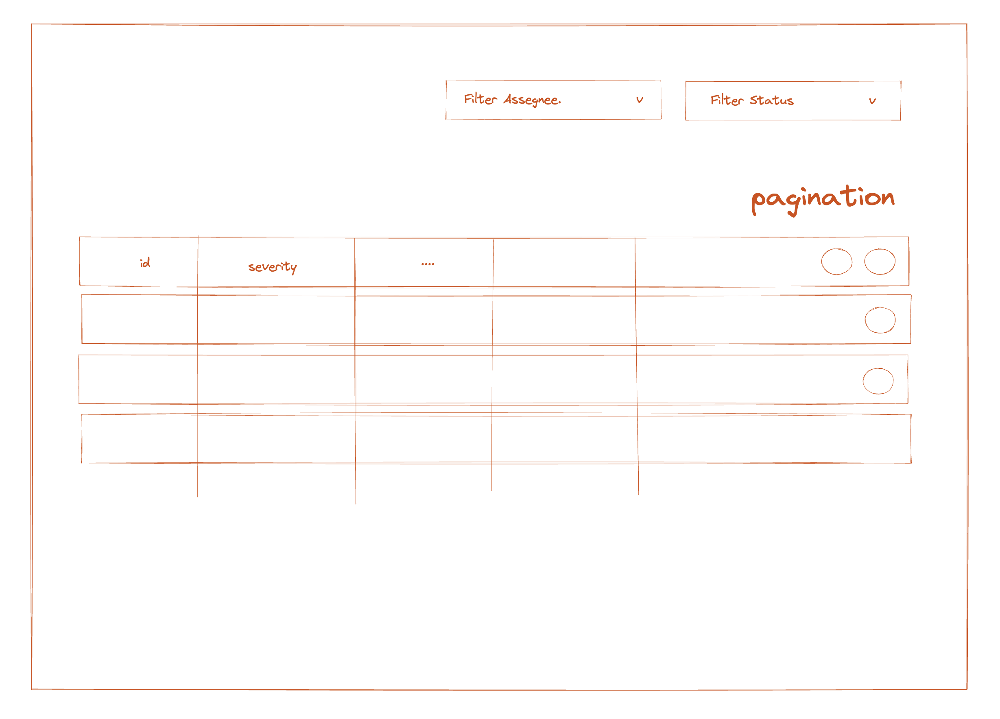

# RedCarbon Frontned Interview 1

This is a [T3 Stack](https://create.t3.gg/) project bootstrapped with `create-t3-app`. The goal of the interview session is to
create a Nice looking and well architected Frontend App based on the API availabe in this repo by tRPC.



## Gettings Started

To setup the project, run

```bash
npx prisma db push
npx prisma db seed
```

This will create the database with prefilled data.

## Required Spec

A unique page showing the list of incidents in the database, this list should be displayed using a table component with the following attributed:

- id
- title
- severity: severity number and a text (LOW MEDIUM HIGH CRITICAL) computed based on the number and the following break poins: 20, 50, 80
- status (OPEN, CLOSED, UNDER_INVESTIGATION)
- assegnee
- tags
- created_at
- updated_at

- The user should be able to navigate the table using a pagination
- The user should be able to order the table based on `created_at` OR `severity` fields
- The user should be able to filter the table on `status` or `assegnee`

In addition to that, the application should provide two actions on incidents:

1. `startInvestigation` that will assign an OPEN incindet to the current user
2. `closeIncindet` that will close an incindet assigned to the current user

The UI should show/hide this actions based on the state of the incindet.

## What's next? How do I make an app with this?

We try to keep this project as simple as possible, so you can start with just the scaffolding we set up for you, and add additional things later when they become necessary.

If you are not familiar with the different technologies used in this project, please refer to the respective docs. If you still are in the wind, please join our [Discord](https://t3.gg/discord) and ask for help.

- [Next.js](https://nextjs.org)
- [NextAuth.js](https://next-auth.js.org)
- [Prisma](https://prisma.io)
- [Tailwind CSS](https://tailwindcss.com)
- [tRPC](https://trpc.io)

## Learn More

To learn more about the [T3 Stack](https://create.t3.gg/), take a look at the following resources:

- [Documentation](https://create.t3.gg/)
- [Learn the T3 Stack](https://create.t3.gg/en/faq#what-learning-resources-are-currently-available) — Check out these awesome tutorials

You can check out the [create-t3-app GitHub repository](https://github.com/t3-oss/create-t3-app) — your feedback and contributions are welcome!

## How do I deploy this?

Follow our deployment guides for [Vercel](https://create.t3.gg/en/deployment/vercel), [Netlify](https://create.t3.gg/en/deployment/netlify) and [Docker](https://create.t3.gg/en/deployment/docker) for more information.
